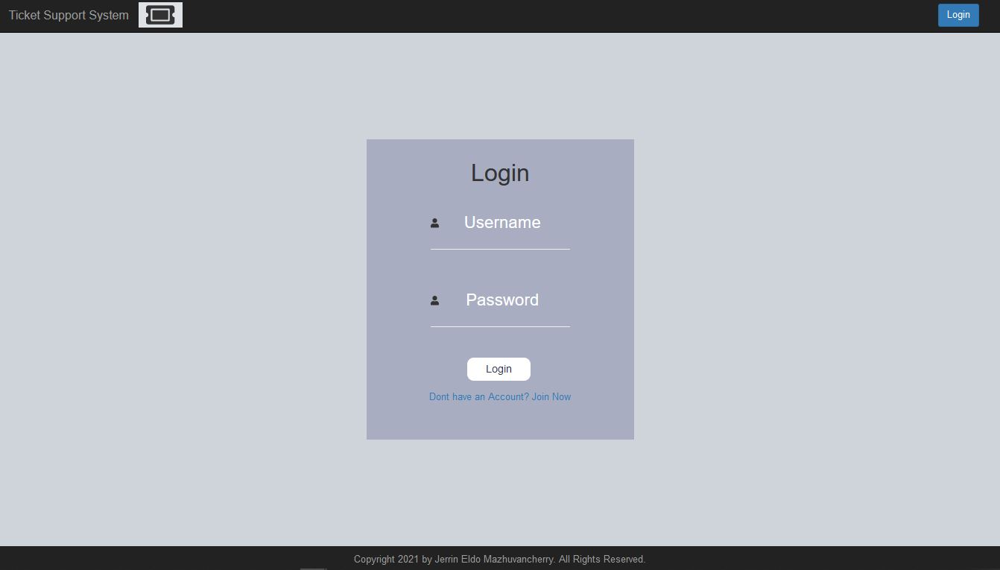

## Application : Support Ticket System 

### Technologies used : HTML, CSS, Bootstrap, PHP, XML and XSD

## Features implemented

- Login Facility using PHP session variables
- Admin/User Facilities
- User would be able to add tickets and add messages to the tickets
- Admin would be able to view all tickets
- Admin would be able to post messages for any tickets
  

### Some of the HTML Interfaces are provided below :

#### Login Page

#### Ticket List for Users

#### Ticket Details

#### Add a Ticket

#### Logout
